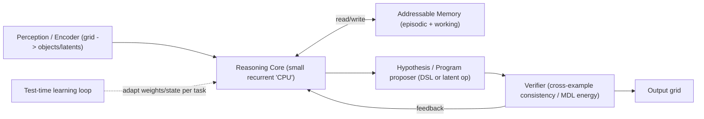

# Post-LLM Research Program: From Next-Token Prediction to a Reasoning Architecture

A theory-first, low-compute program that produces (1) a rigorous research foundation, (2) a conceptual post-LLM architecture spec/manifesto, and (3) staged, laptop-runnable proof-of-concept experiments. The north star is the real open problem the 2026 literature has converged on: **the 2-3x compositional-generalization collapse from ARC-AGI-1 to ARC-AGI-2 that every paradigm exhibits, plus the fact that reasoning is still "knowledge-bound" and expensive.**

## Guiding theses (your intuitions, mapped to live research)

- **"Context limits memory."** Separate *computation* from *addressable memory* (the von Neumann analogy). Live work: SSMs with constant memory (Mamba-3), power-law memory (Sessa), and external/episodic memory.
- **"It's just next-word prediction."** Predict in *latent/abstract space* and optimize for *correctness/compression*, not token likelihood. Live work: JEPA / energy-based models; MDL-based CompressARC; program synthesis ("Parrots to Von Neumanns").
- **"ARC is unsolved."** The gap is compositional, sample-efficient, fluid reasoning — not scale. Tiny zero-pretraining models (TRM, CompressARC) carry the strongest ideas and are runnable by a solo researcher.
- **"Cost is the threat."** Treat skill-acquisition efficiency (Chollet) and $/task as first-class optimization targets, not afterthoughts.

## Architecture concept to pressure-test

The bet: a small core + explicit memory + a propose/verify refinement loop + test-time adaptation + a compression/correctness objective generalizes better per-FLOP than a large next-token transformer.

## Phase 0 - Research workspace scaffolding (lightweight)

- Create a research repo structure (no heavy deps yet): `lit/` (annotated bibliography + paper notes), `ledger/` (limitations ledger + hypothesis register + results log), `spec/` (architecture spec/manifesto drafts), `experiments/` (tiny PoCs), `data/` (ARC tasks).
- Adopt a lab-notebook discipline: every experiment gets a dated entry with hypothesis, setup, metric, result, decision.
- Pull the public ARC-AGI-1/2 task JSONs and the NVARC/TRM/CompressARC reference code for later reuse ([NVARC repo](https://github.com/1ytic/NVARC)).

## Phase 1 - Foundation: literature map + limitations ledger

Build an annotated bibliography organized by pillar, then distill it into a precise, falsifiable statement of what's broken.

- **Pillars to cover** (read with notes in `lit/`):
  - Limits of transformers / next-token objective; scaling vs reasoning.
  - Memory & long context: Mamba-3 ([arxiv 2603.15569](https://arxiv.org/html/2603.15569v1)), Sessa ([arxiv 2604.18580](https://arxiv.org/pdf/2604.18580)), SSM/hybrid long-context characterization ([arxiv 2507.12442](https://arxiv.org/html/2507.12442v3)).
  - World models / latent prediction: JEPA & energy-based models ([JEPA](https://ai.meta.com/blog/yann-lecun-ai-model-i-jepa/)).
  - ARC corpus: 2025 Technical Report ([arxiv 2601.10904](https://arxiv.org/html/2601.10904)), Living Survey of 82 approaches ([arxiv 2603.13372](https://arxiv.org/html/2603.13372v1)), neurosymbolic compositional reasoner ([arxiv 2604.02434](https://arxiv.org/pdf/2604.02434)), "deep learning for ARC / TTFT+AIRV" ([arxiv 2506.14276](https://arxiv.org/html/2506.14276v2)), SOAR (evolutionary program synthesis), TRM, CompressARC, "Parrots to Von Neumanns".
  - Algorithms & information theory (Knuth): TAOCP Vol 4 (combinatorial searching) for program/DSL search; analysis-of-algorithms for cost modeling; Kolmogorov complexity / MDL as the link between Knuth-style algorithmic information and CompressARC's objective.
  - Cognitive science of fluid intelligence / few-shot abstraction (Chollet's "measure of intelligence": skill-acquisition efficiency).
- **Deliverable 1 - `ledger/limitations.md`:** a precise ledger of failure modes, each with evidence and a candidate cause:
  - Bounded context => no persistent episodic memory.
  - Next-token likelihood != correctness/reasoning.
  - Compositional/OOD collapse (the consistent 2-3x AGI-1->AGI-2 drop across all paradigms).
  - Sample inefficiency (hundreds of thousands of synthetic examples to reach 24%).
  - Cost / test-time-compute economics.

## Phase 2 - First-principles problem framing (falsifiable)

- Translate the ledger into **desiderata** and **falsifiable hypotheses**, e.g.:
  - H1 (memory): an explicit read/write memory beats longer context for multi-fact algorithmic recall at equal params.
  - H2 (objective): a compression/MDL or latent-prediction objective generalizes better than next-token on controlled compositional tasks.
  - H3 (test-time learning): per-task adaptation is the dominant lever for fluid generalization (replicating the TTFT 17.5%->45% effect).
  - H4 (compositionality): a propose/verify refinement loop narrows the AGI-1->AGI-2 gap vs a single-pass model.
- Choose **benchmarks runnable on tiny compute**: ARC-AGI-1 (training/eval), an ARC-AGI-2 subset, and synthetic algorithmic-generalization tasks (copy/reverse/sort, parity, graph reachability, arithmetic with length extrapolation) where ground-truth difficulty is controllable.
- Define **metrics up front:** accuracy, generalization gap (AGI-1 vs AGI-2), sample efficiency (accuracy vs #examples), and cost proxy (FLOPs or $/task).

## Phase 3 - Architecture spec / manifesto

- Write `spec/architecture-v0.md`: the post-LLM design synthesizing the pillars (the diagram above) with explicit commitments on: representation (objects/latents vs tokens), memory model, reasoning core (recurrent/refinement), hypothesis substrate (DSL vs learned latent ops), objective (MDL/energy vs likelihood), and the test-time learning loop.
- For each component, cite the strongest prior art and state *why* it should help against a specific ledger item. Include explicit "how this could be wrong" / kill-criteria.
- Keep it shareable (this is your "manifesto" deliverable) and versioned as experiments come in.

## Phase 4 - Tiny proof-of-concept experiments (laptop / single GPU / Colab)

Order chosen to maximize learning per FLOP and to stand on the strongest small-model shoulders first.

- **PoC-A - Reproduce a tiny baseline.** Re-run TRM (~7M params) and/or CompressARC (zero pretraining, single-puzzle MDL) to establish a working, understood baseline on ARC-AGI-1. Anchors all later comparisons.
- **PoC-B - Memory vs context (H1).** Toy reasoning core + external addressable memory vs a same-size pure-sequence model on algorithmic recall/extrapolation tasks.
- **PoC-C - Objective ablation (H2).** Same tiny backbone trained with next-token vs MDL/compression vs latent-prediction objective on a controlled compositional task; measure generalization gap.
- **PoC-D - Test-time learning (H3).** Add per-task adaptation (TTFT/LoRA-style or latent-state refinement) to the baseline; quantify the lift and the cost it adds.
- **PoC-E - Propose/verify refinement loop (H4).** Minimal hypothesis-proposer + cross-example/MDL verifier loop; measure AGI-1 vs AGI-2-subset gap vs single-pass.

## Phase 5 - Measurement, iteration, go/no-go

- Maintain `ledger/results.md`; after each PoC, accept/reject the hypothesis against the pre-registered metric and update the spec.
- Decision gates: keep components that improve the generalization gap and/or sample efficiency at fixed cost; discard the rest. Combine survivors into a "v1" integrated tiny system.

## Phase 6 - Dissemination

- Turn the spec + results into a short paper/writeup; target ARC Prize paper track and/or relevant workshops. Open-source the tiny PoCs for reproducibility.

## Scope notes / assumptions

- Theory-first and small-compute: every experiment is sized for a laptop, a single consumer GPU, or free cloud credits. No frontier-scale pretraining is planned; the strategy deliberately exploits that the best ARC *ideas* live in <10M-param, zero/low-pretraining systems.
- This is inherently iterative research, not a fixed build; phases 2-5 loop. The plan optimizes for cheap, fast falsification of ideas rather than a single big bet.
- "Rearchitecting LLMs" is treated as targeting the named open problem (compositional, memory-rich, sample-efficient, low-cost fluid reasoning), which may or may not remain a language model by the end.
