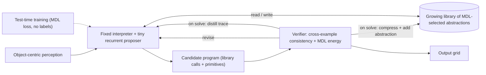
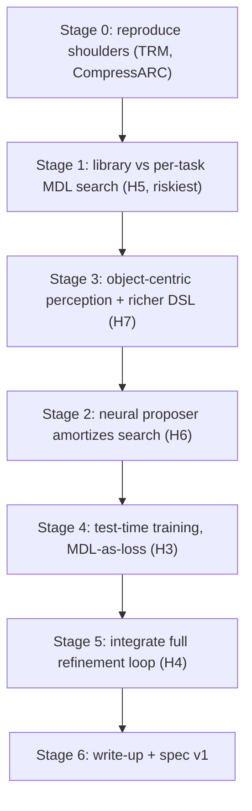

# VNR Build & Test Plan — Von Neumann Reasoner

**Working codename: VNR.** A build-and-test plan for the synthesized architecture from the literature review: a **fixed reasoning interpreter ("CPU") + a growing, addressable library of MDL-selected abstractions ("program memory")**, driven by a tiny neural proposer inside a propose/verify refinement loop, specialized per task by test-time training.

This is the concrete, staged engineering plan that sits under the high-level program in [plan.md](plan.md). It is theory-first and sized for a laptop / single consumer GPU. Hypotheses are pre-registered in [../ledger/hypotheses.md](../ledger/hypotheses.md); limitations targeted are in [../ledger/limitations.md](../ledger/limitations.md).

## Thesis

ARC is fundamentally a **search for the shortest program consistent with the train pairs**. The current field fills the propose/verify/adapt loop with strong-but-partial components; no team combines the strongest option in every slot. VNR's bet is that the combination below covers each component's weakness — and that the genuinely under-explored piece is a **fixed interpreter + a cross-task growing library** (DreamCoder's wake-sleep idea, fused with MDL and test-time training), which the 2025 lit only hints at (CompressARC has MDL but no library; SOAR amortizes search but has no explicit library; the neurosymbolic system has a fixed, non-growing DSL).

| Slot | VNR choice | Lifted from | Targets |
| --- | --- | --- | --- |
| Representation | object/relation-centric grid | neurosymbolic compositional reasoner | L3 |
| Proposer | tiny recurrent core (~M params) | TRM | L5 |
| Objective + verifier | MDL/compression + cross-example consistency | CompressARC | L2, L4 |
| Adaptation | test-time training, MDL-as-loss (label-free) | TTFT line | L4, L3 |
| Memory | growing library of reusable abstractions + fixed interpreter | DreamCoder-style; new assembly | L1, L3, L4 |
| Amortization | distill successful traces into the proposer | SOAR | L4, L5 |

## Architecture

The invariant is the interpreter; only the short, MDL-selected program changes per task. That separation (the von Neumann analogy) is the source of cheap generalization if the thesis holds.

## Build sequence (dependency order)

Ordering principle: **test the riskiest, cheapest-to-falsify assumption first.** Stage 1 (does a growing library actually beat per-task search?) is the load-bearing thesis; if it fails we pivot before investing in the rest.

**Ordering pivot (2026-06-09):** Stage 3 runs **before** Stage 2. Stage 1 accepted H5 but exposed the binding constraint: the 13-op geometric DSL covers only ~2% of real ARC-AGI-1, so amortizing search with a neural proposer (Stage 2) would be optimizing search over a DSL that cannot express real tasks. Raising DSL/perception coverage first makes every later stage's result meaningful on non-synthetic data.

---

## Stage 0 — Reproduce the shoulders
- **Goal:** working, understood baselines + a cost yardstick. De-risk tooling before building anything new.
- **Hardware reality (2026-06-08 pivot):** local GPU is an RTX 3070 Ti (8 GB). TRM full ARC-AGI-1 training needs ~4 H100s for ~3 days, so **TRM is deferred to cloud**; **CompressARC (~12-20 min/task on ~8 GB) is the runnable Stage 0 baseline.**
- **Build:**
  - Verify upstream URLs in [../references/README.md](../references/README.md) are canonical (done: TRM, CompressARC, NVARC).
  - CompressARC (`references/CompressARC`): solve a handful of single dev-split puzzles via the headless harness `experiments/poc-a-baselines/run_compressarc_task.py`; record per-puzzle compute and pass@2. Needs a dedicated venv with the pinned CUDA torch (`torch==2.5.1`, cu124) — the global torch is CPU-only and incompatible.
  - TRM: code-read + cost note now; run on cloud later.
- **Benchmark/data:** fixed 50-task ARC-AGI-1 dev split, committed as `data/dev_split_arc1.json` (built by `data/build_dev_split.py`). CompressARC bundles its own ARC-AGI-1 data, so no conversion is needed.
- **Deliverable:** `experiments/poc-a-baselines/`, notebook entry `experiments/notebook/2026-06-08-stage0-baselines.md`, baseline rows in `ledger/results.md`.
- **Gate:** CompressARC runs and roughly matches reported per-task behavior on the dev split. If reproduction fails, fix tooling before Stage 1.

## Stage 1 — Library vs per-task MDL search (H5, the core thesis)
- **Goal:** decisively test, cheaply, whether a growing cross-task library beats per-task search.
- **Build:**
  - Define a **minimal grid DSL** (a small set of primitives: recolor, translate, mirror, crop, flood-fill, object-map, count) and an **interpreter**.
  - Define the **MDL score** of a program (description length in DSL tokens, with library calls counted at their compressed cost).
  - Implement **enumerative/guided search** to the shortest program consistent with all train pairs.
  - Two arms: **(A) no library** (search from primitives every task) vs **(B) growing library** (after each solved task, compress recurring sub-programs into named abstractions available to later tasks — a sleep/abstraction step).
- **Benchmark/data:** a curated subset of ARC-AGI-1 tasks expressible in the DSL (object/symmetry/counting families) + a synthetic generator for controlled difficulty.
- **Metric / decision rule (H5):** tasks solved per unit search budget, and forward-transfer to held-out tasks; arm B must beat arm A by a pre-set margin at equal compute.
- **Kill-criterion:** no library gain -> the von Neumann framing weakens; pivot.
- **Deliverable:** `experiments/poc-vnr-s1-library/`, notebook entry, results row, spec update.

## Stage 2 — Neural proposer amortizes search (H6)
- **Goal:** make search cheap by learning to propose.
- **Build:** a tiny recurrent proposer (TRM-style) trained on Stage-1 successful traces to rank/condition the DSL search and index library abstractions (wake-sleep / SOAR-style distillation). Compare against uninformed search.
- **Metric / decision rule (H6):** search nodes/FLOPs to first solution at matched solve rate.
- **Deliverable:** `experiments/poc-vnr-s2-proposer/`, notebook + results + spec update.

## Stage 3 — Object-centric perception (H7)
- **Goal:** structurally buy compositionality at the input.
- **Build:** an object/relation extractor (connected components, color/shape/position relations) feeding the proposer; ablate against the raw-grid representation.
- **Metric / decision rule (H7):** AGI-2-subset solve rate, object-centric vs raw-grid, matched solver.
- **Deliverable:** `experiments/poc-vnr-s3-perception/`, notebook + results + spec update.
- **Outcome (2026-06-09): KILL-CRITERION FIRED.** Adding object-selection ops + per-task recolor tokens to the whole-grid DSL moved dev-split coverage by zero (1/50 -> 1/50, same task; ARC-2 probe 0/30) while exhausting the search budget. Conclusion: real ARC tasks are not short compositions of whole-grid transforms; the hypothesis substrate needs a structural redesign — per-object program application (map/filter over objects), relations, masks — or a shift to a neural per-task substrate (CompressARC-style MDL). The H5-on-real-ARC probe was coverage-gated (5/80 training solves -> empty library): **coverage gates everything downstream.**
- **Pivot direction (2026-06-09): Option A — Stage 3b, object-mapped substrate (H7-v2).** Programs become per-object rules (induce object -> fate mappings from one object feature, or select-and-crop by an induced predicate), verified by exact re-simulation, with raw BFS as fallback. Same accept/kill bar as H7-v1 for comparability; if H7-v2 also kills, Option B (neural per-task substrate) is the pre-registered fallback.
- **Stage 3b outcome (2026-06-09): INCONCLUSIVE — union 4/50 (3 new), one short of accept; test-correct 3/50 (one overfit); ~1000x cheaper than token BFS. Continuing as Stage 3c (H7-v3):** three more families (cellwise colormap, gravity, symmetry-fill) + an LOO stability guard so "solved" requires prediction stability on test inputs, not just train consistency.
- **Stage 4 (Option B) launched (2026-06-09): H8 — neural per-task MDL substrate baseline.** Unmodified CompressARC, 2000 steps/task, pass@2, same dev split and numeric bar as H7. Runs on Modal (cloud fan-out, owner-approved <= $30 out-of-pocket; pre-registered smoke-test cost gate with local fallback). Purpose: confirm the substrate clears the bar the symbolic substrate failed, and characterize per-task cost as the control for the real VNR question — cross-task program memory/amortization (H9+).
- **Stage 3c outcome (2026-06-09): KILL-CRITERION FIRED.** New families added zero solves even unguarded (family plateau: remaining tasks need composed/relational/generative reasoning, not more single-rule families); the LOO guard rejected the overfit correctly but also both correct solves (rule identity is underdetermined by 2-4 train pairs — LOO agreement is the wrong verifier for discrete rules). Guarded union 1/50. **Per the pre-registered rule, the hand-built program substrate is closed at this effort level; Option B — neural per-task substrate (CompressARC-style MDL) — is the default next step.** Salvage: segmentation/features front-end, induction-vs-search cost result, and the LOO-verifier negative result.

## Stage 4 — Test-time training, MDL-as-loss (H3)
- **Goal:** per-task specialization without labels.
- **Build:** at test time, adapt the proposer/core by minimizing the MDL/consistency energy on the task's train pairs (label-free TTT). Quantify lift and added cost.
- **Metric / decision rule (H3):** solve-rate lift vs the no-TTT solver, and the compute it costs (cost is a first-class metric).
- **Deliverable:** `experiments/poc-vnr-s4-ttt/`, notebook + results + spec update.

## Stage 5 — Integrate the full refinement loop (H4)
- **Goal:** end-to-end VNR; measure the gap that matters.
- **Build:** wire perception -> proposer+library -> MDL/consistency verifier -> revise, with TTT, into one loop. Optional meta-selection/ensembling across candidates (the lit shows complementary pipelines add ~6 pts).
- **Metric / decision rule (H4):** ARC-AGI-1 vs ARC-AGI-2-subset solve rate and the generalization gap vs single-pass; cost per task.
- **Deliverable:** `experiments/poc-vnr-s5-integrated/`, notebook + results + spec update.

## Stage 6 — Write-up + spec v1
- Promote the validated design into `spec/architecture-v1.md`; turn results into a short write-up targeting the ARC Prize paper track / workshops; open-source the PoCs.

---

## Cross-cutting metrics (tracked in `results.md`)
- Solve rate (per benchmark/family).
- Generalization gap: ARC-AGI-1 vs ARC-AGI-2-subset (and train vs OOD on synthetic tasks).
- Sample/search efficiency: solves per training example / per search node.
- Cost: FLOPs and wall-clock on the reference hardware; cost per task.

## Honest risk register
- **The gap may be partly fundamental.** All paradigms drop 2-3x to AGI-2; VNR might reach ~40-45%, not human ~100%. Success is *relative* improvement at low cost, not "solving" ARC.
- **Integration friction.** Components that work alone can underperform combined; the ensemble evidence suggests diversity > a single monolith. Keep stages ablatable.
- **MDL over a rich operator space is hard** to define and optimize; the DSL may be too weak (misses tasks) or too rich (search explodes).
- **Object-centric perception itself fails on hard AGI-2 perceptual tasks** — a known bottleneck.
- **Search cost** fights the cost goal even when amortized.

## Assumptions
- Theory-first, tiny compute throughout; if a stage needs more, shrink the task until it fits.
- Stages are gated: a failed kill-criterion triggers a documented pivot, not a quiet continuation.
- "Memory" for ARC is realized as the abstraction library; long-context sequence memory (Mamba-3/Sessa) is deferred to the broader post-LLM goal, not the ARC milestone.
